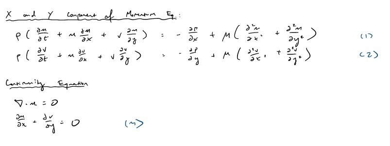

# Nondimensional Form of the Navier-Stokes Equations for the Lid-Cavity Problem {.chapter}

The fluid flow in the lid-driven cavity problem is assumed to be 2D with constant density and dynamic viscosity, thus allowing us to consider the incompressible, steady form of the Navier-Stokes equations for continuity and momentum. 

Let $L$ indicate the length of the cavity wall, $U$ the speed of the lid,  the kinematic viscosity of the fluid,  the density of the fluid, and $P$ the pressure. The variables $x$ and $y$ indicate the coordinate system and $u$ and $v$ represent the fluid velocity components in the $x$ and $y$ directions respectively. 

The reference quantities can be non-dimensionalized as follows:


or

$\tilde{x}=\frac{x}{L}$, $\tilde{y}=\frac{y}{L}$, $\tilde{u}=\frac{u}{U}$, $\tilde{v}=\frac{v}{U}$, $\tilde{p}=\frac{P}{\rho U^2}$, and $\tilde{t}=\frac{tU}{L}$.

We will now substitute the nondimensional terms into the incompressible, steady form of the Navier-Stokes equations, as given below.



The resulting nondimensional continuity equation is given by the following:


Given that $U$,$L$ are constants, we further get:

$$\frac{\partial{\tilde{u}}}{\partial{\tilde{x}}}+\frac{\partial{\tilde{v}}}{\partial{\tilde{y}}}=0$$

Similarly, the nondimensional form of the momentum equation in the x and y directions are derived as follows:

```{r}
imshow("eq/2.jpg")
```

Simplifying, we get for the x-momentum-balance:

$$\frac{\partial{\tilde{u}}}{\partial\tilde{t}}+\mathbf {\tilde{u}} \cdot (\tilde{\nabla} \tilde{u})\ =-\frac{\partial{\tilde{p}}}{\partial\tilde{x}}+{\frac{\nu}{UL}}\Delta\mathbf {\tilde{u}}$$
Likewise, for the y-momentum-balance:

$$\frac{\partial{\tilde{v}}}{\partial\tilde{t}}+\mathbf {\tilde{u}} \cdot (\tilde{\nabla} \tilde{v})\ =-\frac{\partial{\tilde{p}}}{\partial\tilde{y}}+{\frac{\nu}{UL}}\Delta\mathbf {\tilde{u}}$$

The complete form is listed below for convenience:

$${\displaystyle {\frac {\partial \mathbf {\tilde{u}} }{\partial \tilde{t}}}+(\mathbf {\tilde{u}} \cdot \tilde{\nabla})\mathbf {\tilde{u}} \ =-\tilde{\nabla} \tilde{p}+{\frac {1}{Re}}\tilde{\Delta}\mathbf {\tilde{u}} +{\frac {1}{Fr^{2}}}{\hat {g}}.}$$
where $\tilde{\Delta}\mathbf{\tilde{u}} = \tilde{\nabla}^{2}\mathbf{\tilde{u}}$, ${\displaystyle \mathrm {Re} ={\frac {UL}{\nu }}={\frac {\rho UL}{\mu }}}$, and ${\displaystyle \mathrm {Fr} ={\frac {U}{\sqrt {gL}}}}$ as commonly notated.

The only tunable parameter that appears in the lid-driven cavity momentum equations is the inverse of the Reynolds' number $\frac{\nu}{UL}=\frac{1}{Re}$. If this term approaches infinity, the Reynolds' number reaches zero, causing the viscous term to dominate the momentum equation. If this term approaches zero, the Reynolds' number approaches infinity, and the viscous term goes to zero and we can make the inviscid flow assumption. 
