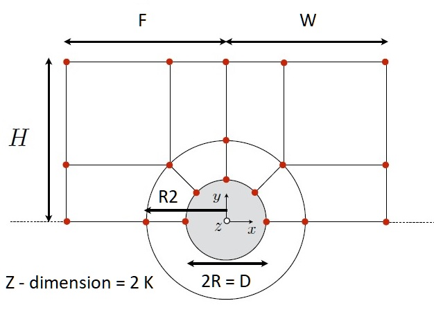
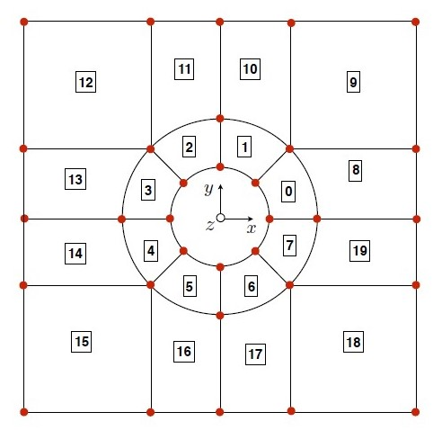
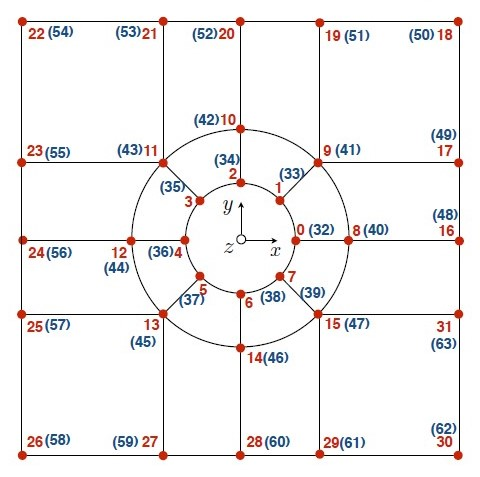
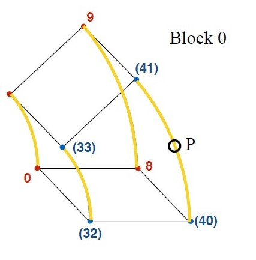
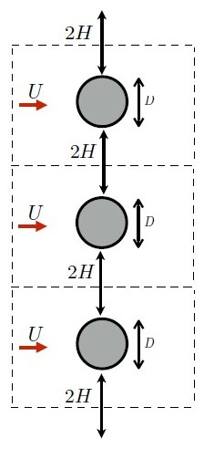

# Mesh Assembly : Preliminaries

We assemble a set of preliminary meshes for simulations with Reynolds number 20 and 110, consisting of an inner cylindrical segment and outer rectangular segment as follows. The following mesh schematics list dimension parameters and block configuration, courtesy of Dr.Fabrizio Bisetti, UT Austin.  

  

The blocks and block vertices are as follows. The blue vertices denote the other Z-plane.  

   

The edges are defined by listing points $P$ as follows.  

 

A symmetry plane is defined in OpenFoam s.t. boundary effects do not significantly affect results. So the resulting simulation will look as below.  

  

For all the meshes unless otherwise noted, the parameters are as follows, with units in meters for all dimensions other than the blockMeshFactor, and Re denoting the Reynolds number.

- f : blockMeshFactor (decreases cell dimensions in each direction by this factor), set by default : `int(max(10, Re/3))`
- R : cylinder radius, default: `1/2`
- R2 : ring block outer radius, default: `3/2`
- H : height as in Prof.'s example, default: `4`
- F : forward distance as in Prof.'s example, default: `4`
- W : wake (backward) distance as in Prof.'s example, default: `4 + Re*(1/15)`
- K : +/- distance in Z-axis --- mostly irrelevant for anything in this project, default: `4`

The preliminary meshes `run_20_1` and `run_110_1` simply follow the default settings.   
BlockMeshDict files are available here: <a href="https://github.com/akhilsadam/coe347-group12/blob/main/2/code/data/run_20_1/system/blockMeshDict">run_20_1</a> and <a href="https://github.com/akhilsadam/coe347-group12/blob/main/2/code/data/run_110_1/system/blockMeshDict">run_110_1</a>,
blockMeshDict logs are available here: <a href="https://github.com/akhilsadam/coe347-group12/blob/main/2/code/data/run_20_1/system/blockMeshDict">run_20_1</a> and <a href="https://github.com/akhilsadam/coe347-group12/blob/main/2/code/data/run_110_1/system/blockMeshDict">run_110_1</a>

 