# Steady Flow:  

## Radial and Tangential Velocity at Cylinder Wall  

We compute radial and tangential velocities along lines $AB$ normal to the cylinder wall, for angles $\Theta = \frac{\pi}{4}, \frac{\pi}{2}, \frac{3\pi}{4}$, as seen in the diagram below. This is done for three meshes with identical dimensions but an increasing number of cells {8500, 19050, 34000, 53000}.

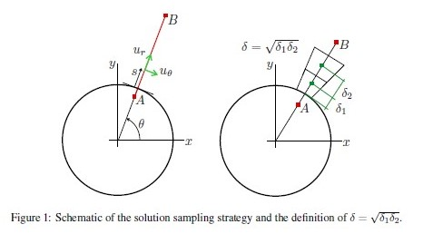  

So for $\Theta = \frac{\pi}{4}$, with increasing numbers of cells:  

  
  
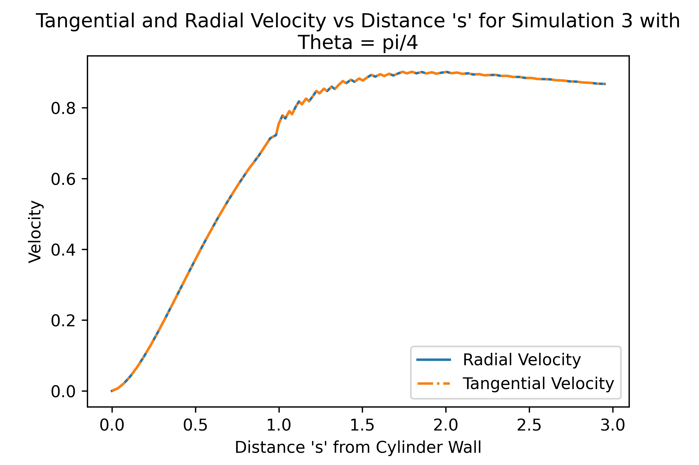  
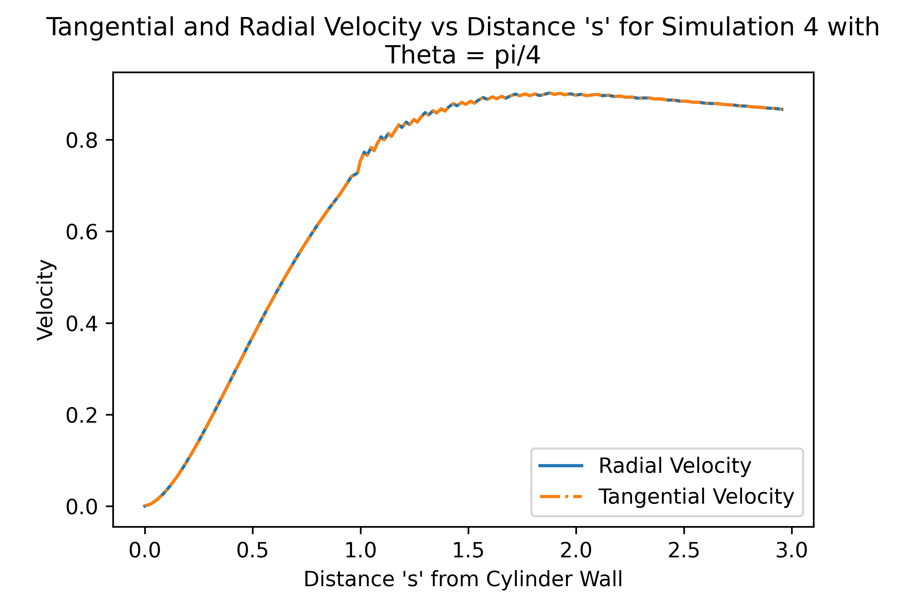  

For $\Theta = \frac{\pi}{2}$, with increasing numbers of cells:  

  
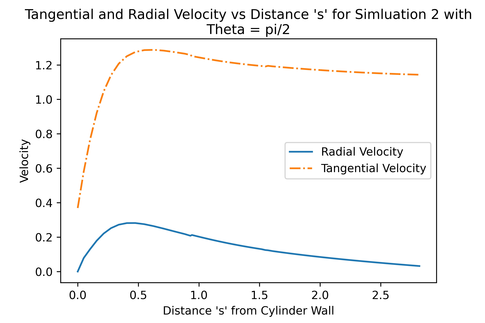  
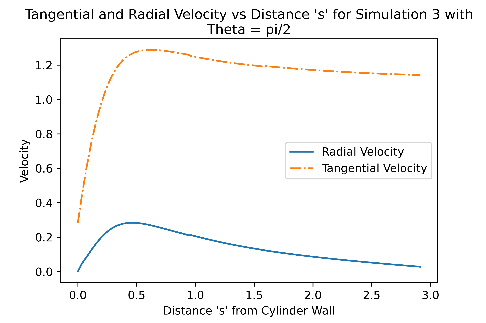  
  

For $\Theta = \frac{3\pi}{4}$, with increasing numbers of cells:  

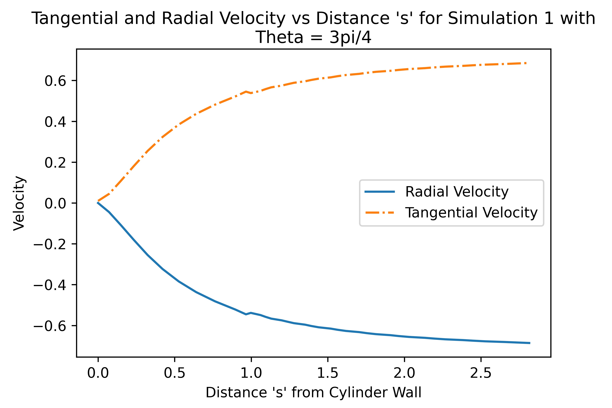  
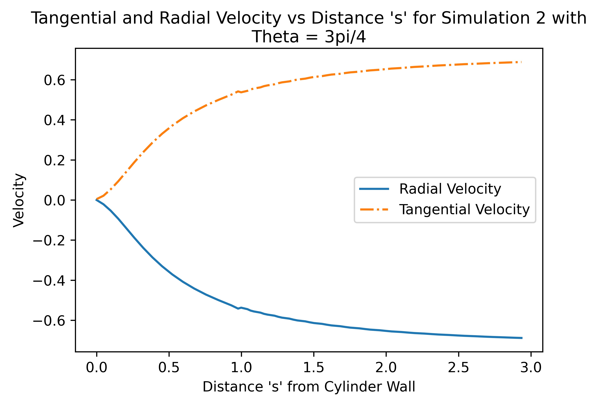  
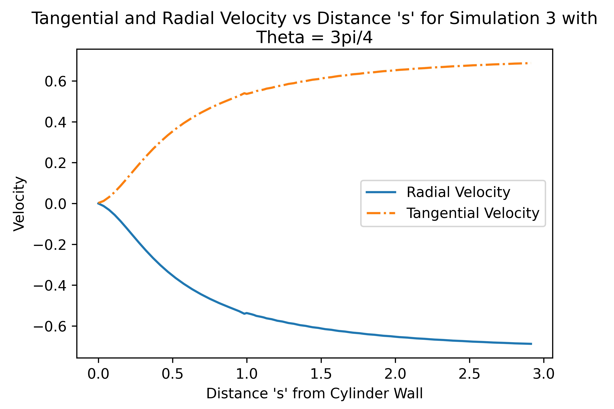  
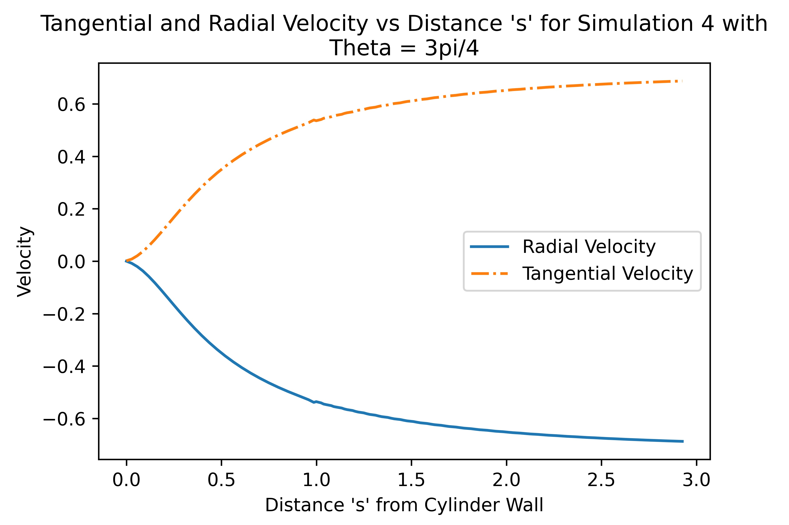  

A table of values comparing the relative recirculation length (L/D) with the components of the rate of strain tensor $e_{rr},e_{r\theta}$ is shown below.   
We define those components as follows.

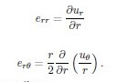  

- (L/D) | $e_{rr}$ at $\pi/4$ | $e_{rr}$ at $\pi/2$ | $e_{rr}$ at $3\pi/4$ | $e_{r\theta}$ at $\pi/4$ | $e_{r\theta}$ at $\pi/2$ | $e_{r\theta}$ at $3\pi/4$ | Meshes in order from run_20_1 to 4.  
- 0.79809 | 0.1837 | 2.5977 | -0.4306 | 0.0586 | 1.4517 | 0.0965
- 0.86399 | 0.1234 | 2.0425 | -0.3213 | 0.0399 | 1.8885 | 0.0778
- 0.83199 | 0.0924 | 1.6610 | -0.2552 | 0.0299 | 2.1238 | 0.0651
- 0.81322 | 0.0737 | 1.3937 | -0.2104 | 0.0239 | 2.2721 | 0.0553  

We see that as the mesh resolution becomes finer, the values for $e_{rr}$ and $e_r\theta$ do converge, but not nearly as quickly as the velocity field does (as seen in the above plots)!

Note the L/D recirculation length is expected from the results in Park et. al. As seen in the below image, Park et. al. also predict a recirculation length of about 0.8 diameters.   

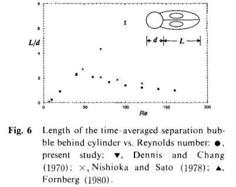  
