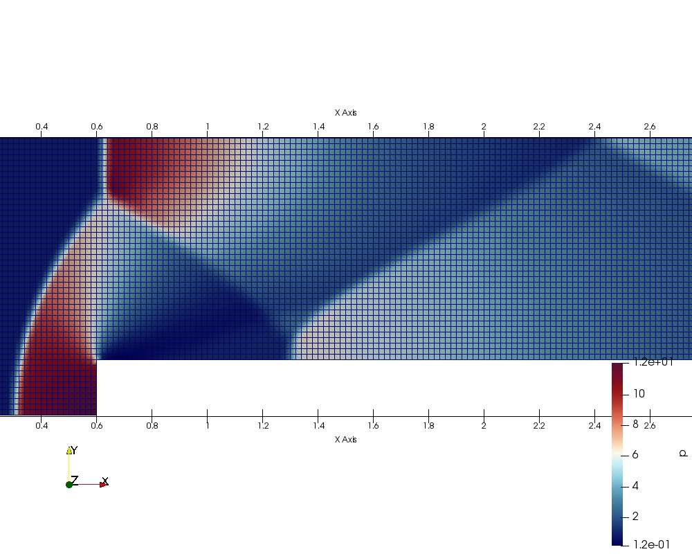
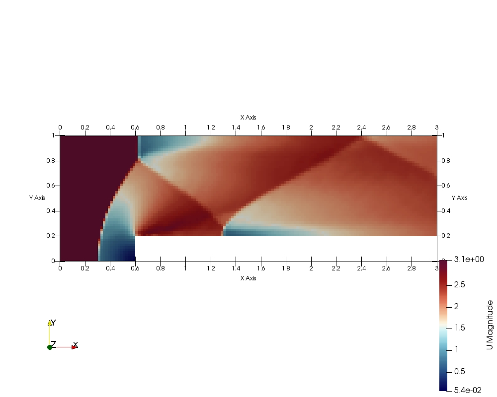
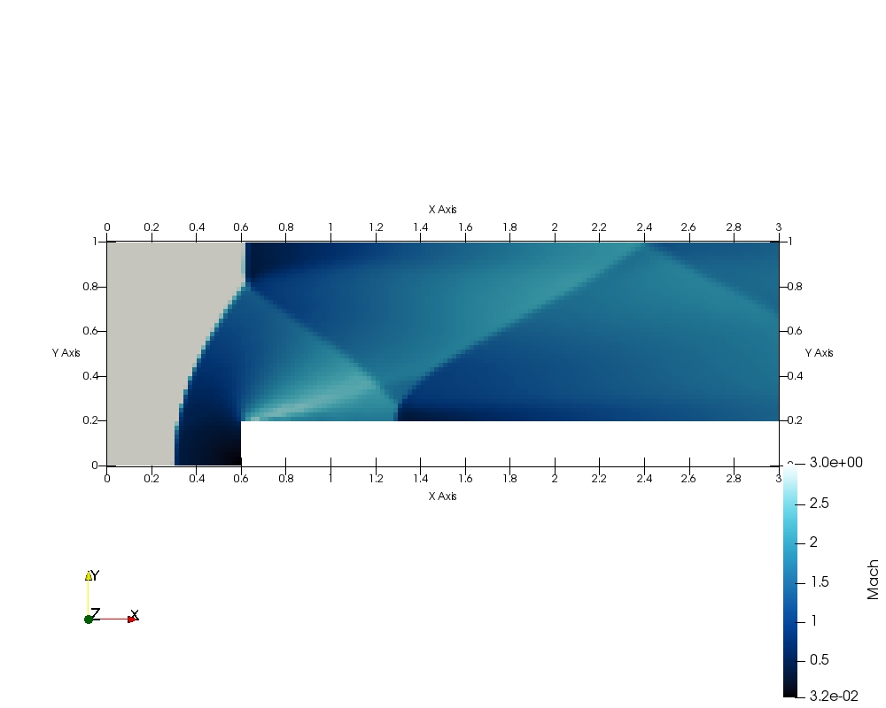
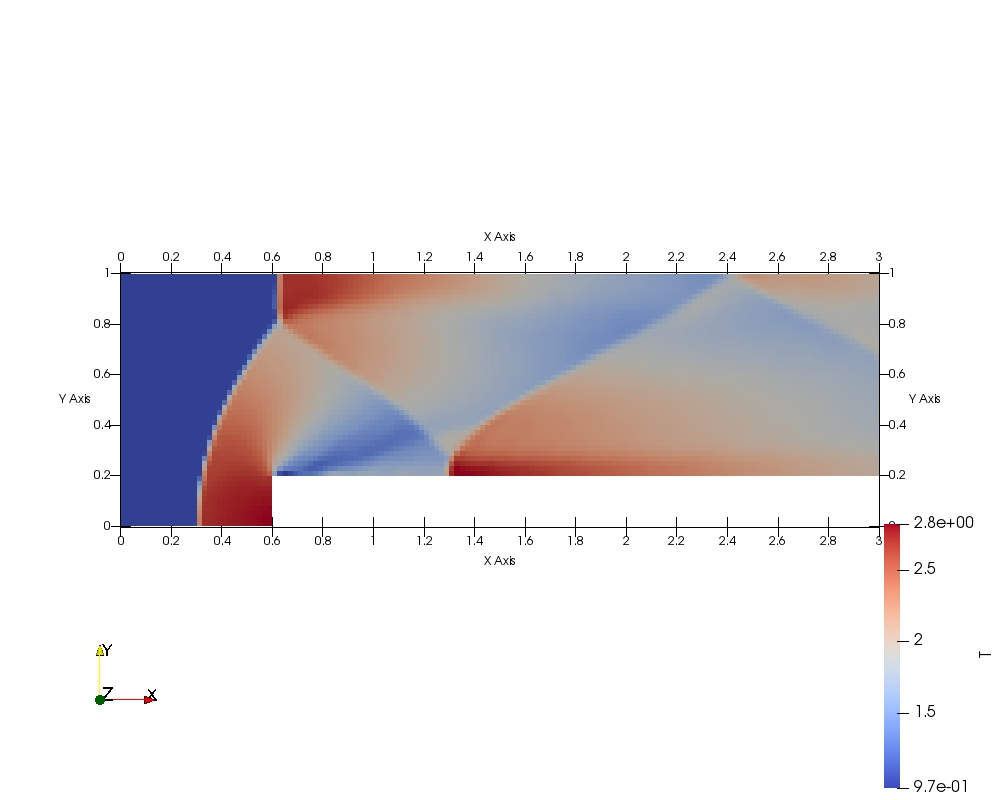

# Theory : Governing Equations  
 
 
 
 
 
 
 
 
 
 
 
 
 
 
 

# Mesh Assembly : Preliminaries

We assemble a preliminary solution at $T = 4s$ with 6300 cells, for the following inlet conditions: $M=3$,$p=1Pa$,$T=1K$,$\rho = \gamma \frac{kg}{m^3}$ with $\gamma = 1.4$. All results have been non-dimensionalized: velocity, pressure, density and temperature are all measured with respect to inlet conditions.  

## Mesh  

  

## Density  

  

## Velocity X,Y, Magnitude    

  

  

  

## Pressure

  

## Mach Number  

  

## Speed of Sound  

  

## Temperature  

  

