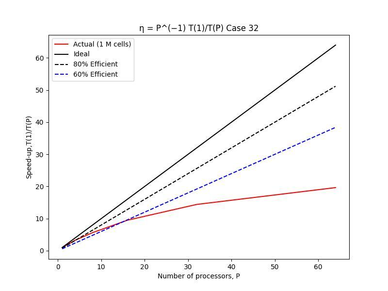
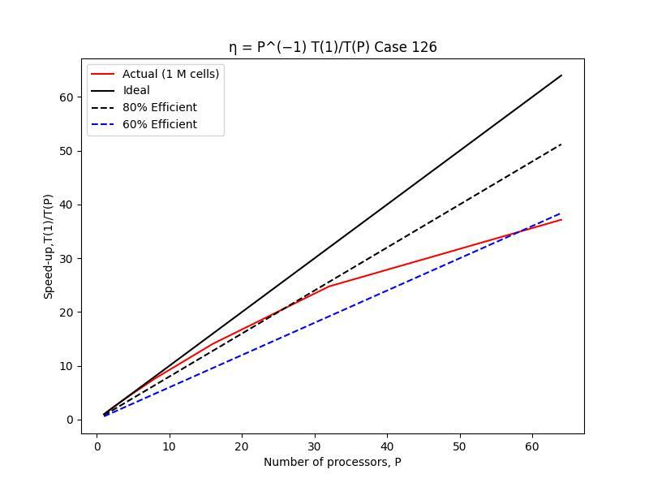

# Parallel Performance Improvements

Define the speedup as the time taken for one processor ($T(1)$) divided by the time taken for $P$ processors ($T(P)$). Similarly, let the parallel efficiency $\eta$ be the speedup divided by $P$.  

Note that the tables report the total $T(P)$, not that of single steps. The single step $T(P)$ is used instead for the plots.

On a mesh of 64512 cells, for $P$ ranging from 1 to 64 in steps of 2, the following scaling is obtained.  

$T(P)$    Speedup    $\eta$   
4870.28    1.0000    1.0000    
2745.57    1.7738    0.8869    
1493.30    3.2614    0.8154        
0865.21    5.6290    0.7036      
0513.54    9.4837    0.5927    
0337.99    14.409    0.4503    
0247.94    19.642    0.3069     

  

A slightly improved scaling is obtained for a mesh of 1000188 cells.  

$T(P)$       Speedup    $\eta$   
270763.66    1.0000    1.0000    
034192.10    2.0239    1.0119    
034129.40    3.9783    0.9946
039850.40    7.6188    0.9524    
021542.00    14.094    0.8808          
012256.70    24.765    0.7739        
008170.29    37.171    0.5808    

  

Clearly the larger mesh case scales much more nicely, which can be expected due to the more even load distribution.   

