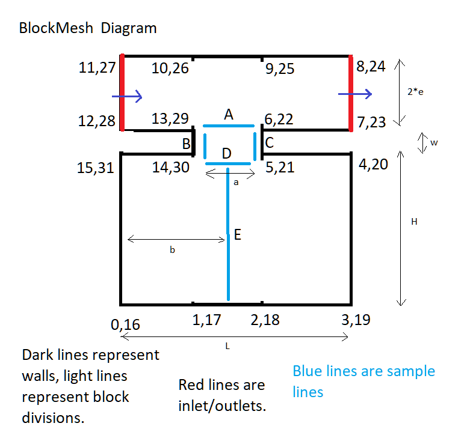
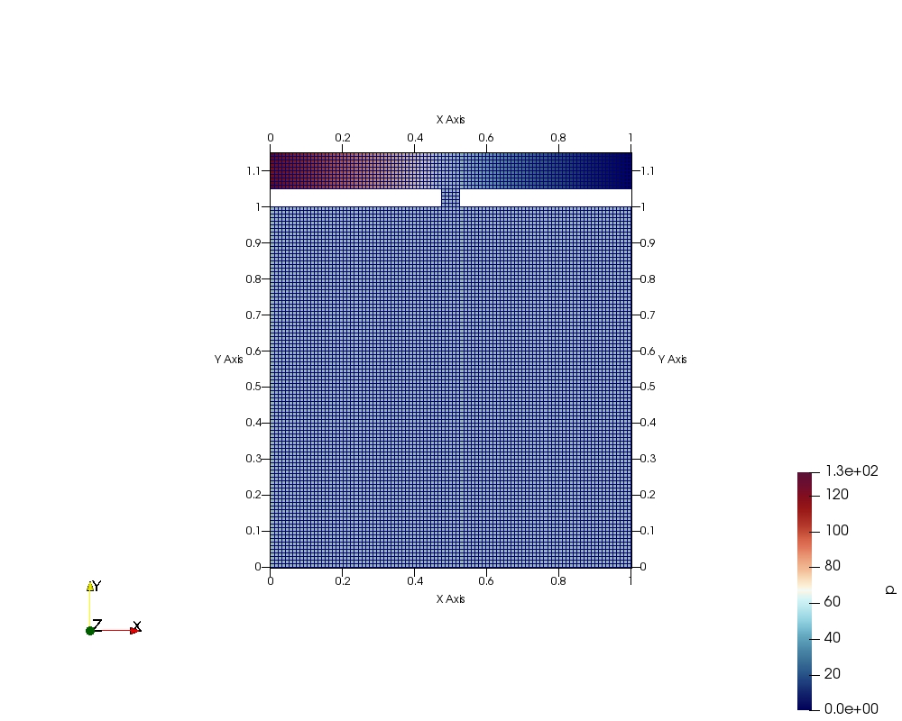
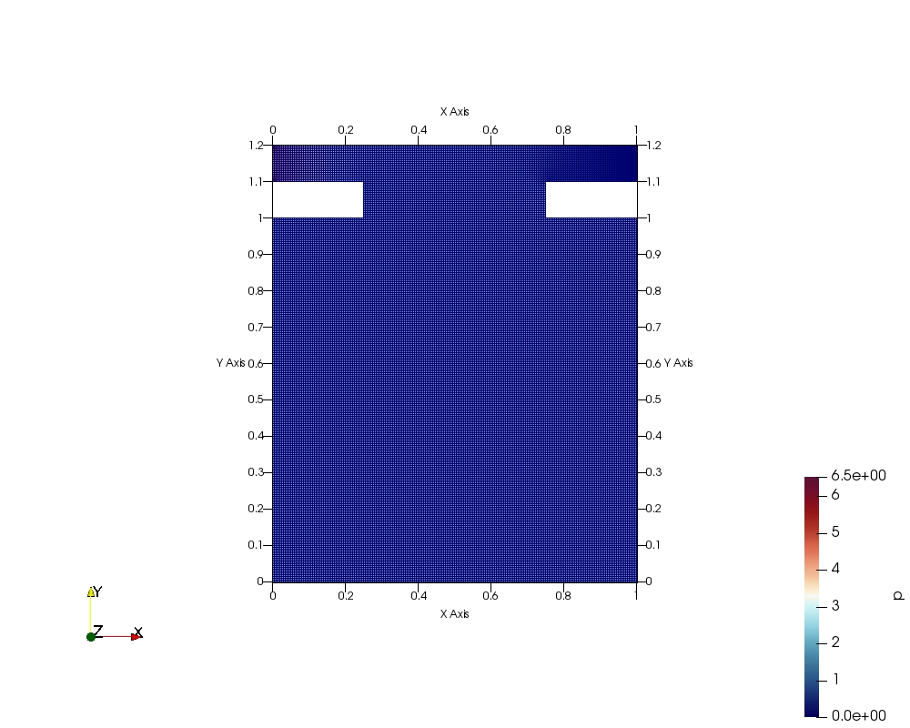

# Mesh Assembly

We assemble a 2D mesh template as below, with the following parameters, all lengths nondimensionalized in terms of dimension $L$:  

mutable: wall thickness $w$, window width $a$,   
immutable: window location $b=0.5$, cavity height $H=1$, cavity width $L=1$, and free-stream width $2e=0.1$.  
  

{width=50% height=25%}  

Two sets of simulations are performed, one for the low Reynolds ($Re$) numbers of 10 and 200, which will be shown to be steady, and another for $Re=1000, 10000$.  

Each mesh also has a corresponding refinement, which is described by the $meshFactor$ parameter, representing the refinement in each dimension.  


Full lists are available below.

## Meshes for the Low Reynolds simulations


```{r, tidy=FALSE}
data2 <- read.table(stringsAsFactors = FALSE, header = TRUE, sep="/", text =
'meshfactor/Reynolds/a/w
5/10/0.05/0.05
5/10/0.05/0.1
5/10/0.50/0.05
5/10/0.50/0.1
10/10/0.05/0.05
10/10/0.05/0.1
10/10/0.50/0.05
10/10/0.50/0.1
5/200/0.05/0.05
5/200/0.05/0.1
5/200/0.50/0.05
5/200/0.50/0.1
10/200/0.05/0.05
10/200/0.05/0.1
10/200/0.50/0.05
10/200/0.50/0.1'
)
knitr::kable((data2), booktabs = TRUE,
caption = '')
```

## Meshes for the High Reynolds simulations


```{r, tidy=FALSE}
data2 <- read.table(stringsAsFactors = FALSE, header = TRUE, sep="/", text =
'meshfactor/Reynolds/a/w
3/1000/0.50/0.1
5/1000/0.50/0.1
3/10000/0.50/0.1
5/10000/0.50/0.1'
)
knitr::kable((data2), booktabs = TRUE,
caption = '')
```
 

BlockMeshDict and similar files are available at <a href="https://github.com/akhilsadam/coe347-group12/tree/main/4/code/param">the repository</a>.  

## Mesh Images  

A couple mesh samples are shown here; see the appendix for all images.  

 
meshFactor, Re, windowWidth, wallThickness=5, 10, 0.05, 0.05:  
{width=100% height=50%}  

  

meshFactor, Re, windowWidth, wallThickness=10, 200, 0.5, 0.1:  
{width=100% height=50%}  


Now that the mesh resolutions can be seen as adequate, we will move to results.  
