# Low Reynolds Number  

Note again all values are nondimensionalized - all lengths are in terms of $L$, the cavity length, all speeds in terms of $U$, the initial flow speed, and all times in terms of $\frac{L}{U}$.  

The pressure is in terms of $\frac{p}{\rho U^2}$.  


## General Solution Form  

We will now show the pressure, X-velocity, Y-velocity, and streamlines in sets of 4 by varying geometry along the following pattern. Contours are not shown due to their bias toward out-of-cavity portions and the coarse mesh will be omitted for brevity. Convergence studies will be done numerically afterward.    


Pattern:  

```{r, tidy=FALSE}
data2 <- read.table(stringsAsFactors = FALSE, header = TRUE, sep="/", text =
'window size a / wall thickness w
0.05 / 0.05
0.05 / 0.1
0.50 / 0.05
0.50 / 0.1'
)
knitr::kable((data2), booktabs = TRUE,
caption = '')
```

### Re=10, Pressure

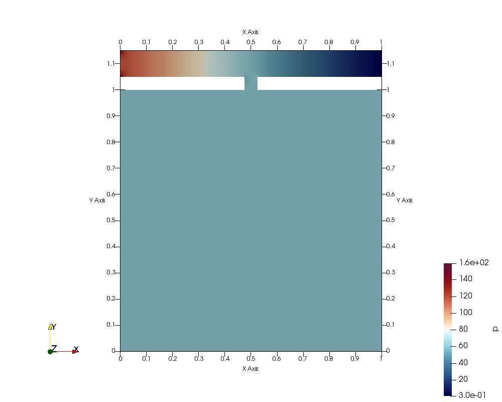{width=40% height=20%}
{width=40% height=20%}
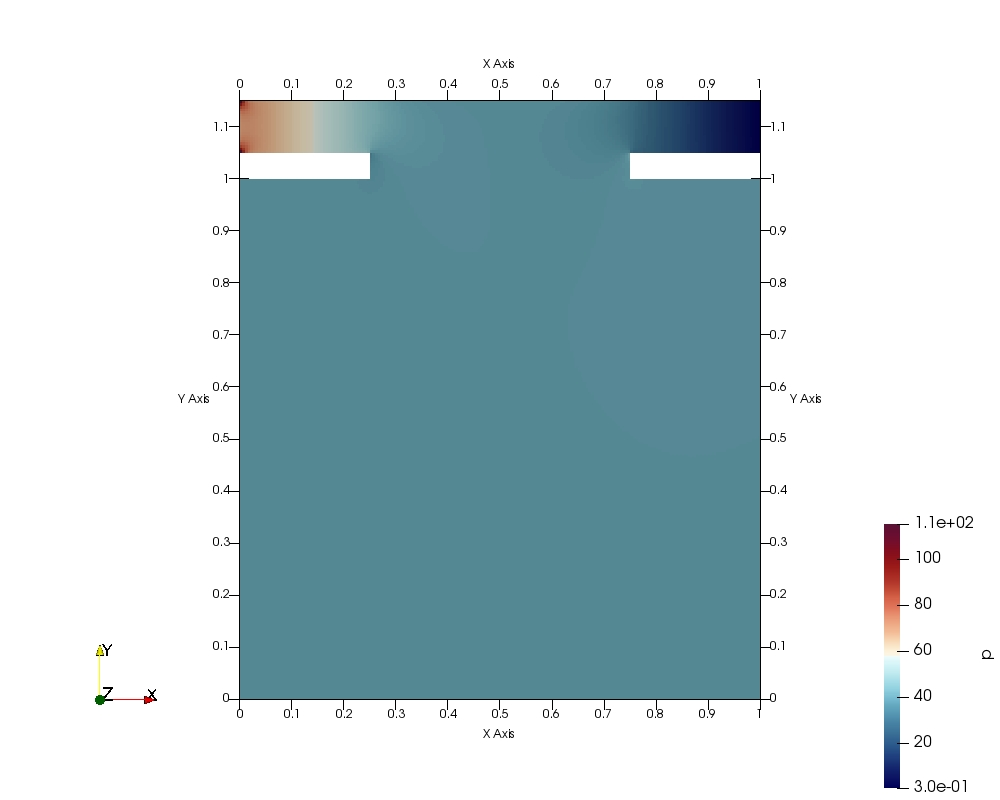{width=40% height=20%}
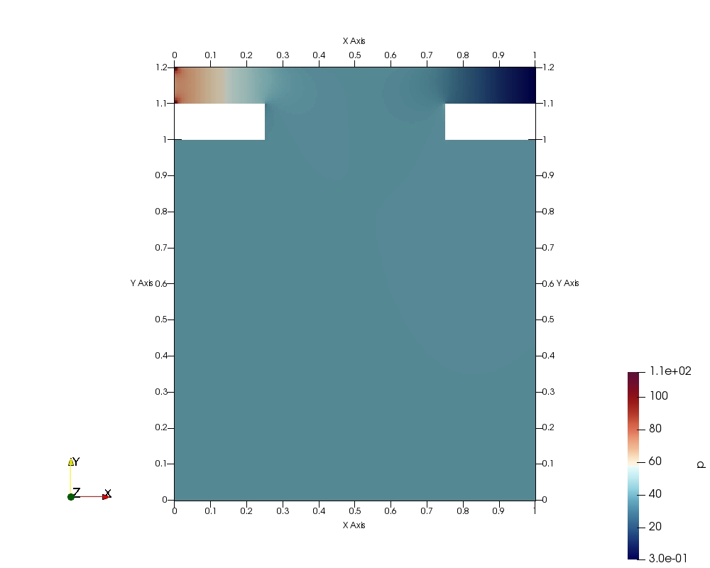{width=40% height=20%}  

### Re=10, X-velocity

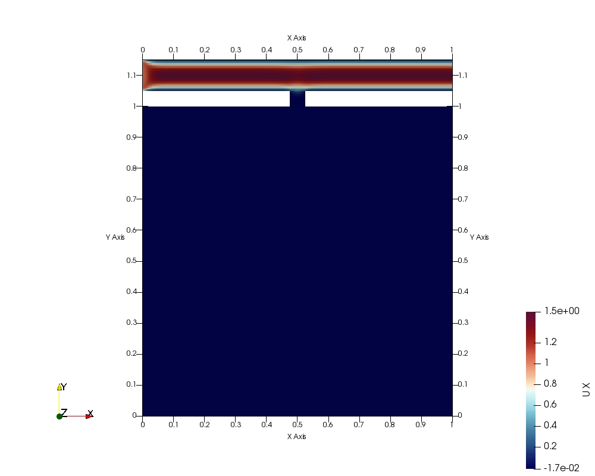{width=40% height=20%}
{width=40% height=20%}
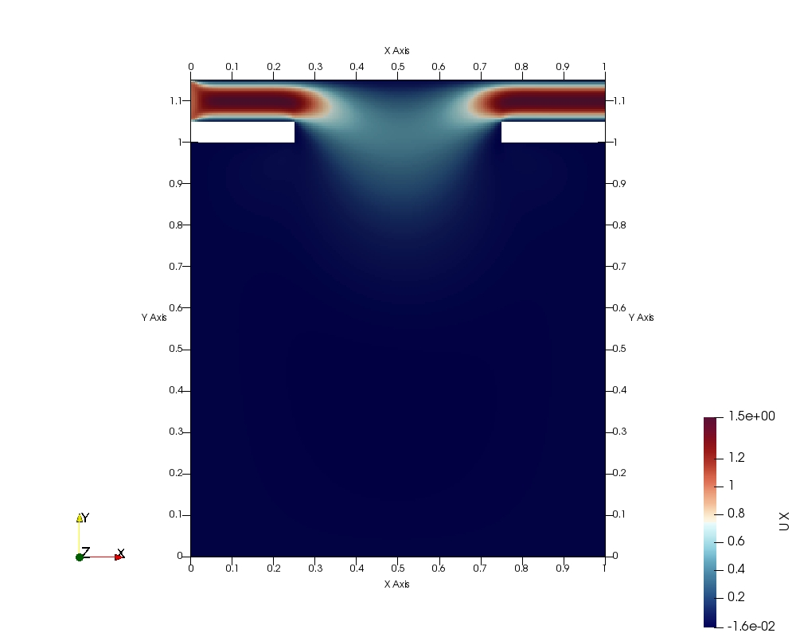{width=40% height=20%}
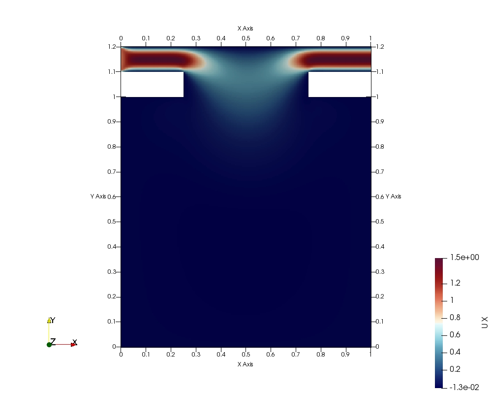{width=40% height=20%}  

### Re=10, Y-velocity

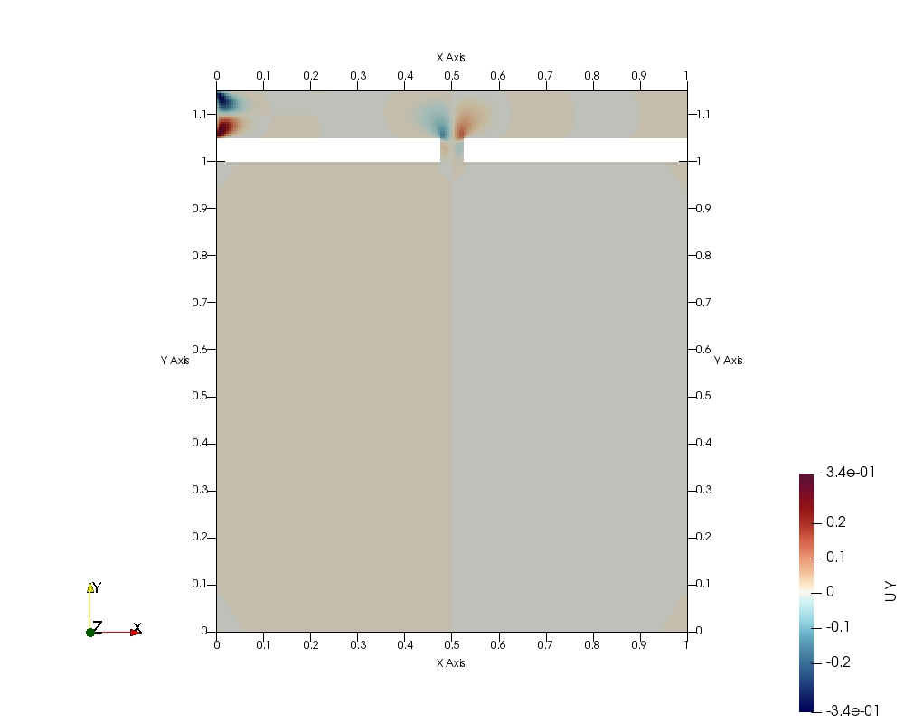{width=40% height=20%}
{width=40% height=20%}
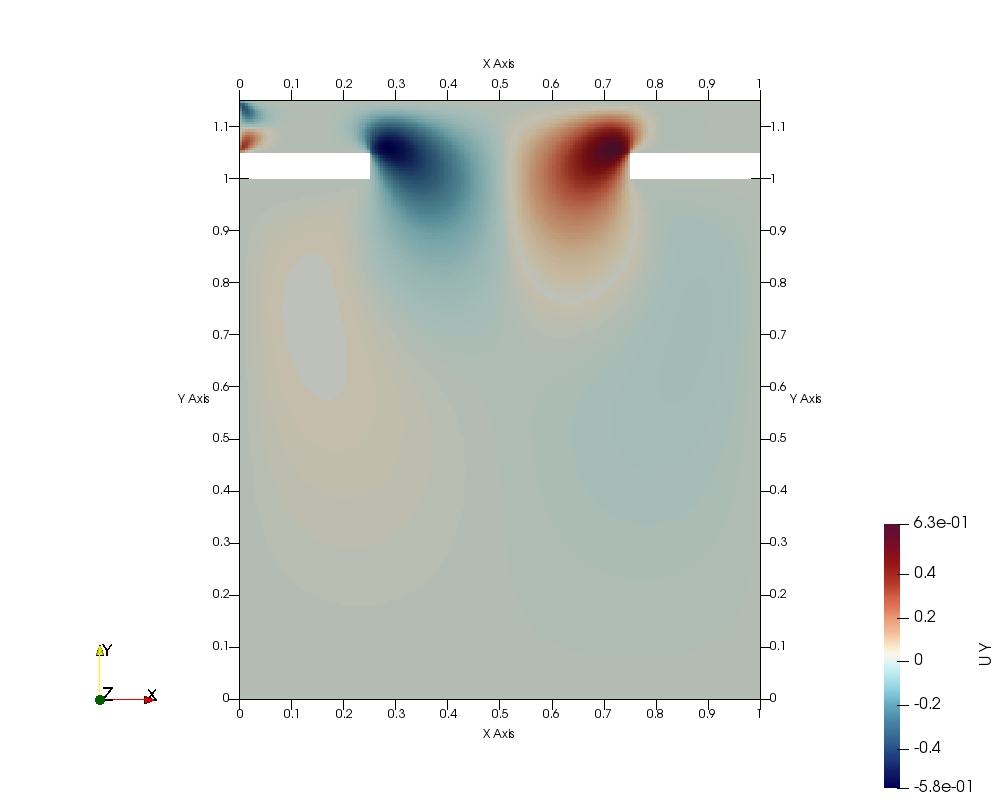{width=40% height=20%}
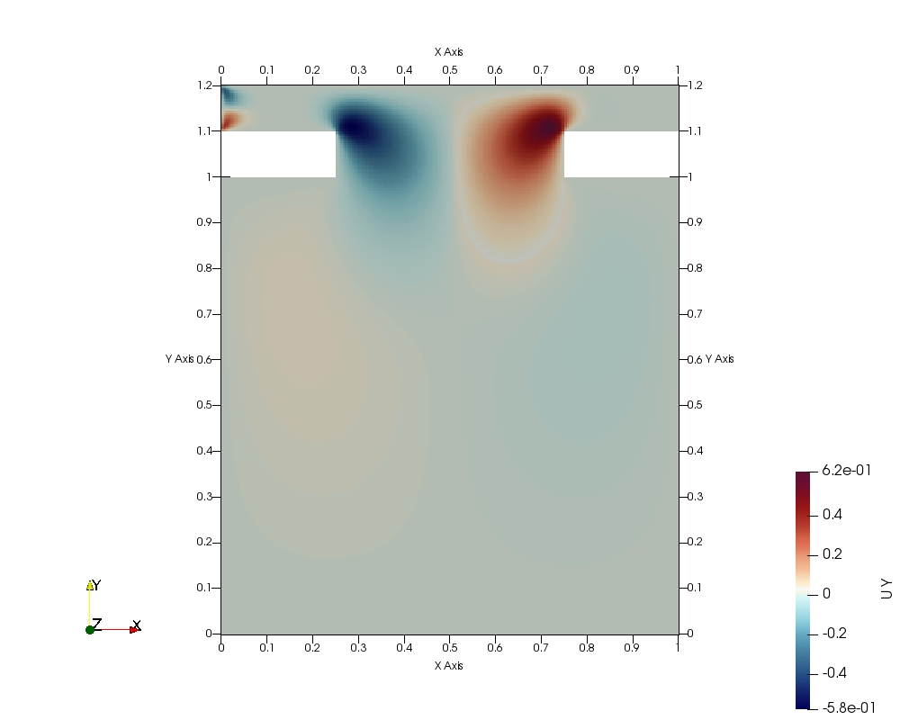{width=40% height=20%}  

### Re=10, Streamlines

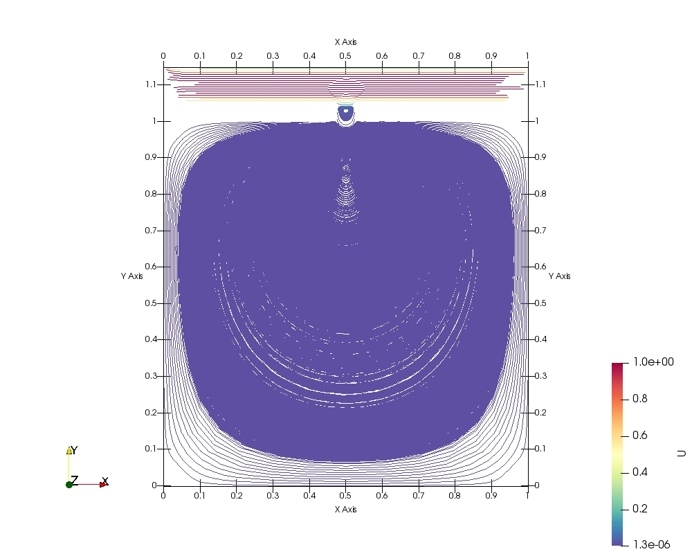{width=40% height=20%}
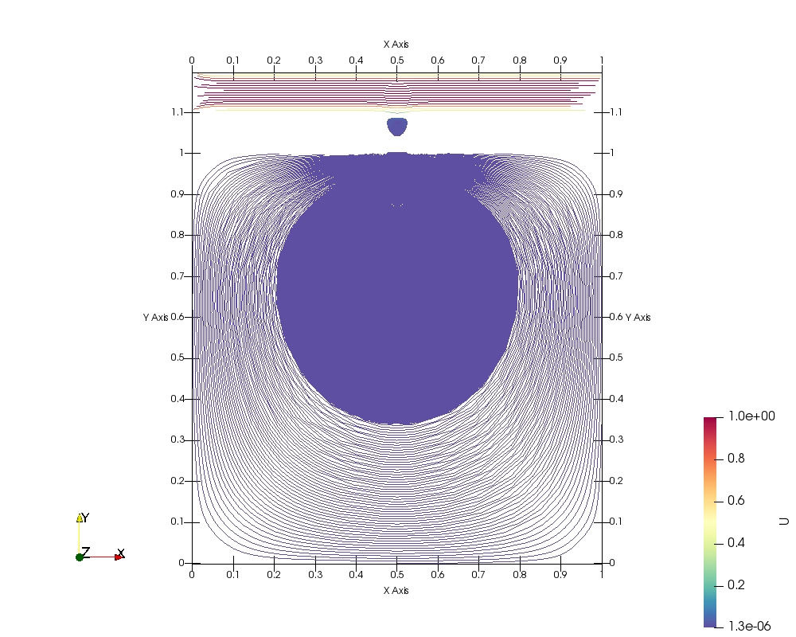{width=40% height=20%}
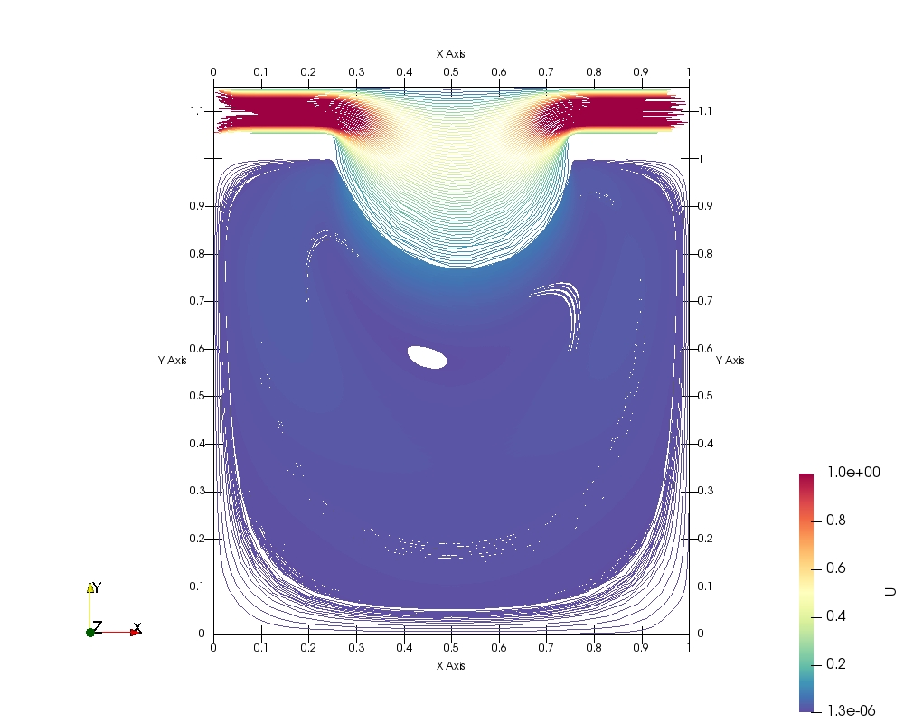{width=40% height=20%}
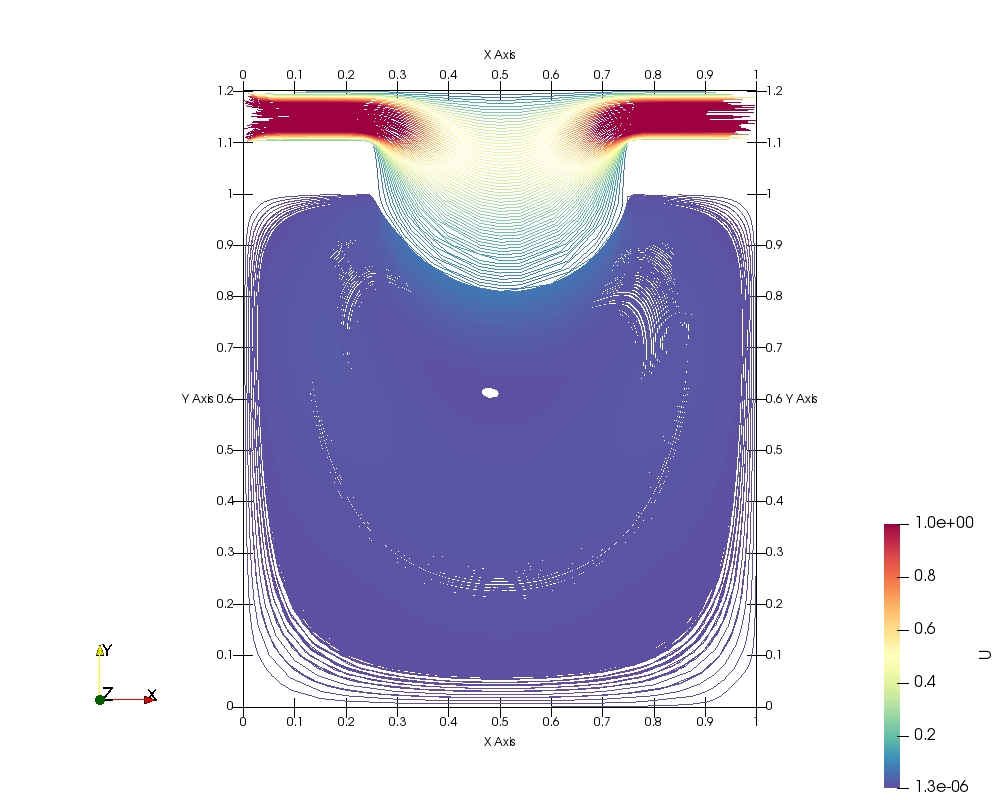{width=40% height=20%}  

## Vortice Positions
```{r, tidy=FALSE}
data2 <- read.table(stringsAsFactors = FALSE, header = TRUE, sep="/", text =
'meshfactor/Reynolds/window(a)/wall(w)/Vortex Center Location along Y
5/10/0.50/01/0.605
10/100/0.05/01/0.6425
5/200/0.05/01/0.975
10/50/0.05/01/0.6075
5/50/0.05/01/0.965
10/100/0.05/005/0.8575
10/10/0.05/01/0.965
10/200/0.50/01/0.8325
5/50/0.50/01/0.685
10/100/0.50/005/0.7425
3/10000/0.50/01/0.641667
3/1000/0.50/01/0.691667
10/200/0.05/005/0.8675
10/200/0.05/01/0.6875
5/100/0.50/01/0.775
5/50/0.05/005/0.835
5/200/0.50/005/0.765
5/200/0.05/005/0.855
5/50/0.50/005/0.655
10/10/0.50/005/0.5725
10/10/0.50/01/0.6075
10/100/0.50/01/0.7825
10/50/005/005/0.8525
5/10000/050/01/0.595
5/10/050/005/0.565
10/200/050/005/0.7725
5/10/005/005/0.835
5/200/050/01/0.825
5/1000/050/01/0.705
10/50/050/005/0.6625
5/10/005/01/0.965
10/50/050/01/0.6875
10/10/005/005/0.8525
'
)
knitr::kable((data2), booktabs = TRUE,
caption = '')

## Window Wall Solution Profiles

- profiles for Left and Right


## Cavity Midline Solution Profile

- midline profiles
